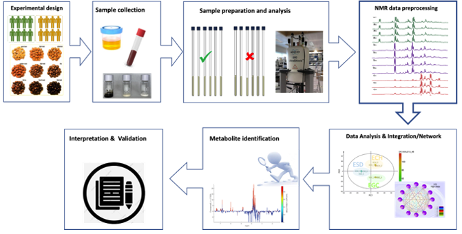
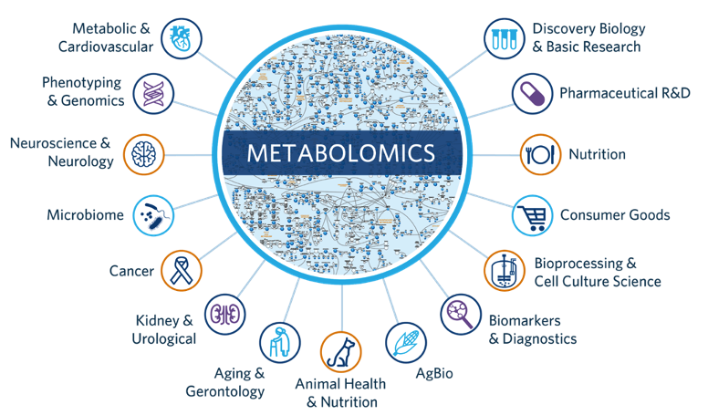

---
output:
  word_document: default
  html_document: default
---
# Metabolomics

Metabolomics is a scientific discipline within the broader field of systems biology that focuses on the comprehensive study of small molecules, known as metabolites, within a biological system. Metabolites are the end products of cellular processes, representing the molecules involved in and produced by the various biochemical reactions occurring within cells. These metabolites include a wide range of compounds such as amino acids, lipids, sugars, and organic acids. The goal of metabolomics is to understand the dynamic metabolic processes occurring in cells, tissues, or organisms. Additionally, metabolites can reflect the outcome of interactions between an organism's genes and its environment. Metabolomics aims to identify and quantify these metabolites to understand the biochemical processes occurring in cells, tissues, or entire organisms. Key aspects of metabolomics include:

1. **Scope of Metabolites:** Metabolomics encompasses the study of a wide range of small molecules, including amino acids, lipids, sugars, organic acids, and other compounds involved in cellular metabolism. The goal is to provide a holistic view of the metabolic profile of a biological system.

2. **Analytical Techniques:** Metabolomics relies on various analytical techniques to detect and quantify metabolites. Mass spectrometry (MS) and nuclear magnetic resonance (NMR) spectroscopy are commonly used methods. These technologies allow researchers to measure the abundance and structural features of metabolites in complex biological samples.

3. **Metabolite Identification:** Identifying metabolites is a crucial aspect of metabolomics. This involves comparing experimental data with databases of known metabolites, utilizing retention indices, mass spectra, and other characteristics for accurate identification.

4. **Quantitative Analysis:** Metabolomics provides quantitative information about the concentration of metabolites in biological samples. This quantitative data is essential for understanding metabolic fluxes, changes in response to stimuli, and variations between different physiological or pathological states.

5. **Data Analysis and Interpretation:** The large datasets generated in metabolomics experiments require sophisticated data analysis techniques. Statistical methods, bioinformatics tools, and pathway analysis are employed to extract meaningful information, identify patterns, and understand the biological implications of the metabolomic data.

6. **Integration with Other Omics Technologies:**

Metabolomics is often integrated with genomics, transcriptomics, and proteomics data to achieve a more comprehensive understanding of biological systems. This integrated approach, known as systems biology, helps elucidate the complex interactions within living organisms.

## Metabolomics Workflow

The metabolomics workflow involves a series of steps from sample collection to data analysis. The metabolomics workflow provides a structured approach to conducting metabolomics experiments, ensuring robust data generation and meaningful biological interpretation. Keep in mind that specific details may vary based on the experimental design, analytical techniques, and the goals of the study (Figure 1). Here is a general outline of the key stages in a typical metabolomics experiment.

1. **Experimental Design:**
   - Define the research question or hypothesis.
   - Determine the biological samples (e.g., tissues, biofluids) to be analyzed.
   - Consider experimental variables, including treatment conditions, time points, and replicates.

2. **Sample Collection and Preparation:**
   - Define the research question or hypothesis.
   - Determine the biological samples (e.g., tissues, biofluids) to be analyzed.
   - Consider experimental variables, including treatment conditions, time points, and replicates.

3. **Sample Derivatization (if necessary):**
   - In some cases, derivatization may be required to improve the stability and detectability of certain metabolites, particularly in gas chromatography-mass spectrometry (GC-MS) analysis.

4. **Instrumental Analysis:**
   - Perform metabolite analysis using the chosen analytical technique (e.g., mass spectrometry or nuclear magnetic resonance spectroscopy).
   - For mass spectrometry, use either gas chromatography-mass spectrometry (GC-MS) or liquid chromatography-mass spectrometry (LC-MS) depending on the nature of the metabolites.
   - Acquire raw data, including mass spectra, retention times, and peak intensities.

5. **Data Pre-processing:**
   - Clean and pre-process raw data to remove noise, correct for systematic errors, and align peaks.
   - Normalize data to correct for variations in sample concentration, extraction efficiency, and instrument performance.

6. **Metabolite Identification:**
   - Match experimental data against metabolite databases (e.g., METLIN, HMDB) to identify known metabolites.
   - Employ retention indices, mass spectra, and other features for confident identification.
   - For NMR, analyze spectra to identify and quantify metabolites based on chemical shifts.

7. **Quantitative Analysis:**
   - Use internal standards or reference compounds for calibration and absolute quantification.
   - Utilize peak intensities or integrated areas for relative quantification.
   - Generate concentration profiles for identified metabolites.

8. **Statistical Analysis:**
   - Apply statistical methods to identify significant differences between experimental groups.
   - Use univariate (e.g., t-tests) and multivariate (e.g., PCA, PLS-DA) analyses.
   - Assess the reliability of the findings through statistical validation.

9. **Biological Interpretation:**
   - Interpret the results in the context of the biological question or hypothesis.
   - Explore metabolic pathways and networks using bioinformatics tools.
   - Identify key metabolites and pathways associated with experimental conditions.

10. **Integration with Other Omics Data:**
    - If applicable, integrate metabolomics data with genomics, transcriptomics, and proteomics data for a systems biology approach.
    - Analyze cross-omics interactions to gain a comprehensive understanding of biological processes.

11. **Validation:**
    - Validate findings through additional experiments, targeted analyses, or independent datasets.
    - Confirm the reliability of identified biomarkers and their association with the studied conditions.

12. **Reporting and Publication:**
    - Document the experimental design, methods, results, and conclusions.
    - Prepare data visualizations and figures to communicate findings effectively.
    - Publish results in scientific journals or present at conferences.

## Applications

These applications highlight the versatility of metabolomics in providing insights into the complex metabolic processes across different organisms and environments, contributing to advancements in medicine, agriculture, biotechnology, and environmental science (Figure 2).

1. **Disease Biomarker Discovery:**
   - *Human Health:* Metabolomics is used to identify biomarkers associated with various diseases, including cancer, diabetes, cardiovascular diseases, and neurological disorders. These biomarkers can aid in early diagnosis, prognosis, and monitoring of disease progression.

2. **Pharmacometabolomics:**
   - *Drug Development:* Metabolomics helps in understanding how drugs are metabolized in the body, identifying potential drug toxicity, and discovering metabolic signatures associated with drug responses. This information contributes to drug development and personalized medicine.

3. **Nutritional Metabolomics:**
   - *Dietary Studies:* Metabolomics is applied to study the impact of diet on metabolism, identifying metabolites associated with specific dietary patterns. It helps in understanding nutritional status, dietary interventions, and personalized nutrition.

4. **Environmental Metabolomics:**
   - *Toxicology:* Metabolomics is used to assess the impact of environmental pollutants and toxins on living organisms. It provides insights into the metabolic responses to environmental stressors and aids in toxicological studies.

5. **Microbial Metabolomics:**
   - *Microbiome Research:* Metabolomics is employed to study the metabolic activities of microbial communities, including the human gut microbiome. It helps in understanding the role of microbiota in health and disease.

6. **Plant Metabolomics:**
   - *Crop Improvement:* Metabolomics contributes to crop improvement by identifying metabolites associated with desirable traits, such as increased nutritional content, resistance to pests, and adaptation to environmental stress.

7. **Sports and Exercise Science:**
   - *Performance Monitoring:* Metabolomics is used to monitor metabolic changes in response to exercise and physical activity. It helps in understanding energy metabolism, fatigue, and recovery processes in athletes.

8. **Agricultural Research:**
   - *Plant Stress Response:* Metabolomics is applied to study how plants respond to biotic and abiotic stress factors. It provides insights into the metabolic pathways involved in stress tolerance and adaptation.

9. **Metabolic Engineering:**
   - *Biotechnology:* Metabolomics plays a role in metabolic engineering, where organisms are engineered to produce specific metabolites for industrial applications, such as biofuel production and pharmaceutical synthesis.

10. **Aging and Longevity Studies:**
    - *Biogerontology:* Metabolomics is used to investigate changes in the metabolome associated with aging. It helps in understanding the metabolic processes underlying aging and age-related diseases.

11. **Veterinary Medicine:**
    - *Disease Diagnosis in Animals:* Metabolomics is applied to diagnose diseases in animals, monitor livestock health, and study metabolic changes in response to various factors.

12. **Quality Control in Bioprocessing:**
    - *Biopharmaceutical Production:* Metabolomics is employed for quality control in bioprocessing industries to ensure the consistency and quality of biopharmaceutical products.
    
    
## [**Hands-on**](./Content.html)
