---
output:
  word_document: default
  html_document: default
---

# Hands-on Metabolomics

## 1. Import NMR data and data pre-processing

1. Go to RStudio.

2. Set the working directory:
   ```R
   setwd("D:/R program training/Metabom8_demo/Data metabolomics/NMR data")
   ```

3. Define the path to NMR experiment:
   ```R
   data.file <- ("D:/R program training/Metabom8_demo/Data metabolomic/NMRdata")
   ```

4. Import NMR data:
   ```R
   # Import 1D MRS data
   read1d_proc(data.file, exp_type = list(PULPROG = 'cpmgpr1d'))
   ```

5. Plot single spectrum (optional):
   ```R
   # Use 'spec' to plot a single spectrum, e.g., in row position 15:
   spec(X[15,], ppm, shift = range(ppm), interactive = TRUE)
   ```

6. Overlay spectra:
   ```R
   # Use 'matspec' to overlay spectra, in ppm range 0 to 10
   matspec(X, ppm, shift = range(ppm), interactive = TRUE)
   ```


7. Create run order:
   ```R
   # Create run-order based on acquisition date
   meta$runOrder <- rank(as.POSIXct(meta$a_DATE))
   ```

8. Plot TSP signal:
   ```R
   specOverlay(X, ppm, shift = c(-0.05,0.05),
       an = list('Facet' = meta$a_EXP,
                 'RunOrder' = meta$runOrder,
                 'Pulse Program' = meta$a_PULPROG))
   ```

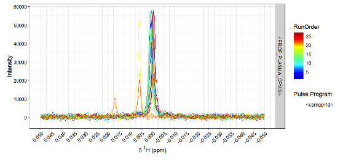

9. TSP calibration:
   ```R
   # Perform TSP calibration
   X_cal <- calibrate(X, ppm, type = 'tsp')

   # Plot TSP after calibration
   matspec(X_cal, ppm, shift = c(-0.1,0.1), interactive = FALSE)

   # Plot TSP signal
   specOverlay(X_cal, ppm, shift = c(-0.05,0.05),
               an = list('Facet' = meta$a_EXP,
                         'Receiver Gain' = meta$a_RG,
                         'Pulse Program' = meta$a_PULPROG))
   ```

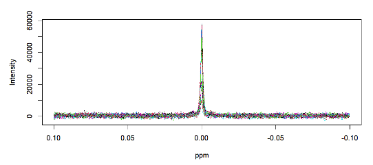

10. Assessment of spectral quality:
    ```R
    # Calculate quality control measures
    matspec(X_cal, ppm, shift = c(4.3,5), interactive = FALSE, main = 'Residual Water')
    matspec(X_cal, ppm, shift = c(8.2,8.4), interactive = FALSE, main = 'LowField Cap')
    matspec(X_cal, ppm, shift = c(-1,0.4), interactive = FALSE, main = 'UpField Cap')
    ```

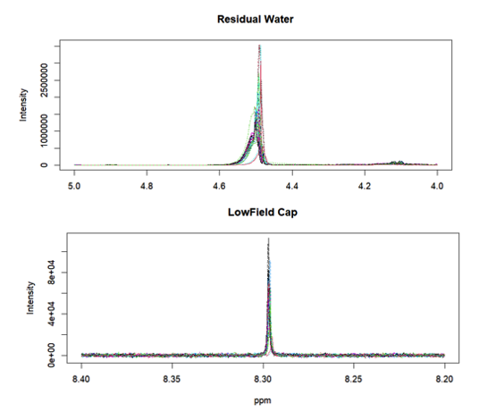
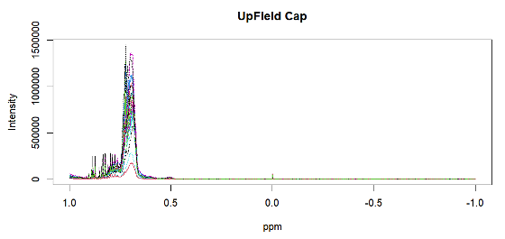

11. Remove unwanted region (excision of signals):
    ```R
    # Indexing TSP region and upfield noise...
    idx_tsp <- get_idx(range = c(min(ppm), 0.4), ppm)
    # ... water region...
    idx_water <- get_idx(range = c(4.3, 5), ppm)
    # ... as well as downfield noise regions
    idx_noise <- get.idx(range = c(8.4, max(ppm)), ppm)

    idx_rm <- c(idx_tsp, idx_water, idx_noise)

    # Excision of TSP, res. water, and noise regions
    X_cut <- X_cal[, -idx_rm]
    ppm <- ppm[-idx_rm]
    ```

12. Baseline correction:
    ```R
    # Baseline correction
    X_bl <- bcor(X_cut)

    # Visual assessment
    Xcompare <- rbind(X_bl[1,], X_cut[1,])
    matspec(Xcompare, ppm, shift = c(7, 9), interactive = FALSE)
    matspec(Xcompare, ppm, shift = c(3, 4), interactive = FALSE)

    matspec(X_cut, ppm, shift = range(ppm), interactive = FALSE)
    matspec(X_cut, ppm, shift = c(1.2, 1.7), interactive = FALSE)
    ```

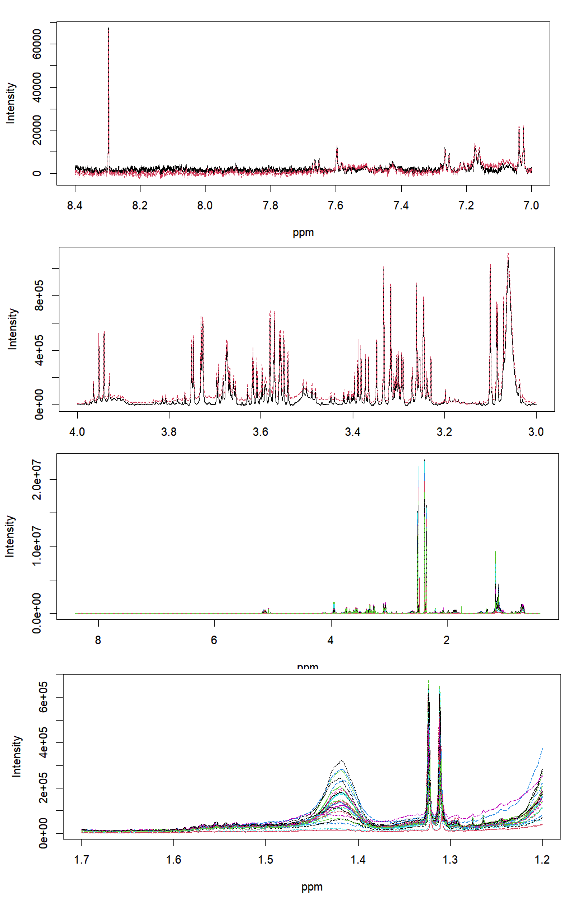

## 2. Multivariate Analysis

1. Load metadata:
   ```R
   # Load metadata
   library(readxl)
   metadata <- read_excel("Sample sheet.xlsx")
   an <- metadata
   dim(an)
   [1] 27 5
   ```

2. Visual inspection of the NMR data:
   ```R
   # Visualize the first ten spectra
   matspec(Xn[1:10,], ppm, shift = c(0, 10), interactive = FALSE)
   ```

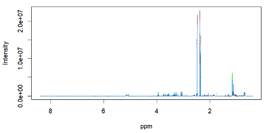

## 3. Unsupervised Analysis

Perform PCA:
```R
# Perform PCA
pca_model <- pca(X = X_bl, pc = 2, scale = 'Pareto', center = TRUE)

# Plot PCA results: scores of the first two components
plotscores(obj = pca_model, pc = c(1,2), an = list(Groups = an$Group), title = 'PCA - Scores plot')
```


Plot PCA loadings:
```R
# Plot PCA loadings
plotload(mod = pca_model, pc = 1) # 1st principal component 
plotload(mod = pca_model, pc = 2) # 2nd principal component 
plotload(mod = pca_model, pc = 2, shift = c(6,9))  # 2nd principal component chemical shift region 6-9 ppm
```
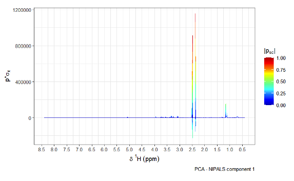
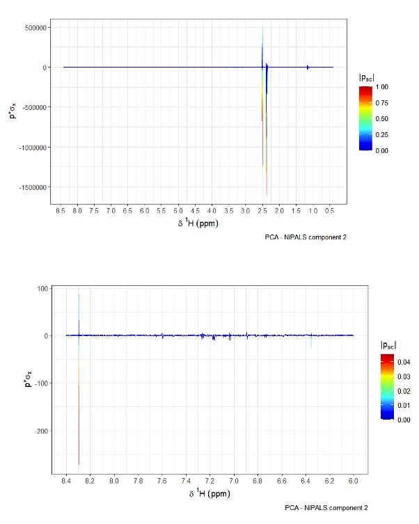

## 4. Supervised Analysis

1. Exclude sham-obese group:
```R
idx = an$Group != 'Sham-obese'
Xrs = Xal[idx,]
Y = an$Group[idx]

# Train O-PLS model
opls.model = opls(Xrs, Y)
```
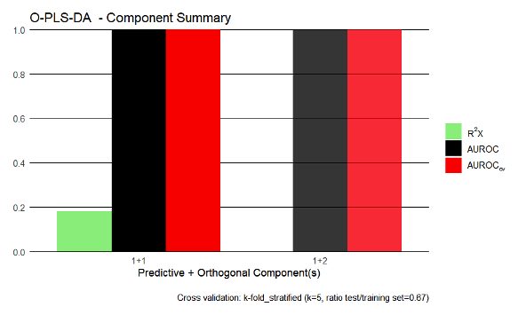

2. Visualization of O-PLS Scores and Loadings:
```R
# Plot OPLS scores
plotscores(obj = opls.model, an = list(
  Group = an$Group[idx] # coloring according to surgery type
  ),
  cv.scores = TRUE, legend = "out") # visualize cross-validated scores
```
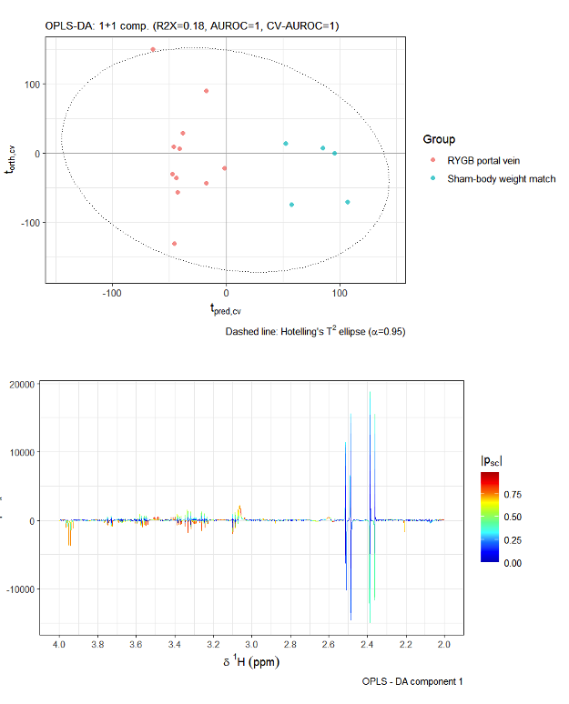

3. Permutation of O-PLS:
```R
permutation = opls_perm(opls.model, n = 100, plot = TRUE, mc = FALSE)
plotload(opls.model, shift = c(2, 4), pc = 1, type = "Backscaled")
```
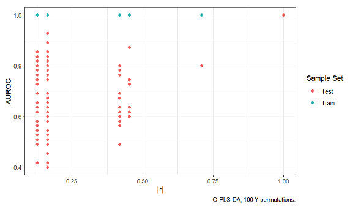

## 5. Metabolite Identification

1. STOCSY:
```R
# STOCY
driver_1 = 1.16
stocy_mod = stocsy(Xal, ppm, driver = driver_1, plotting = TRUE)
plotStocsy(stoc_mod = stocy_mod, shift = c(1.1,4.2))
```
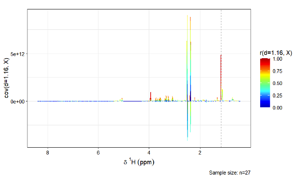

2. Go to Chenomx

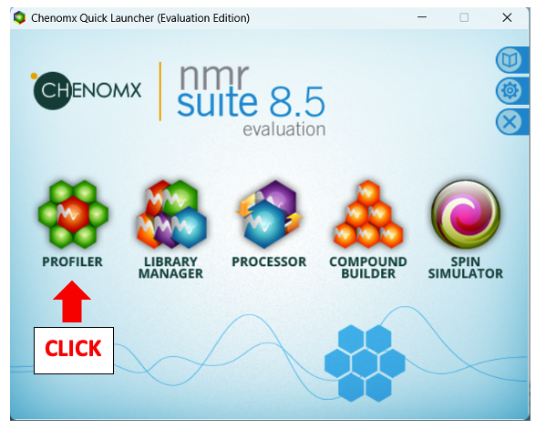
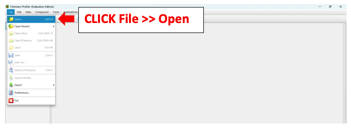
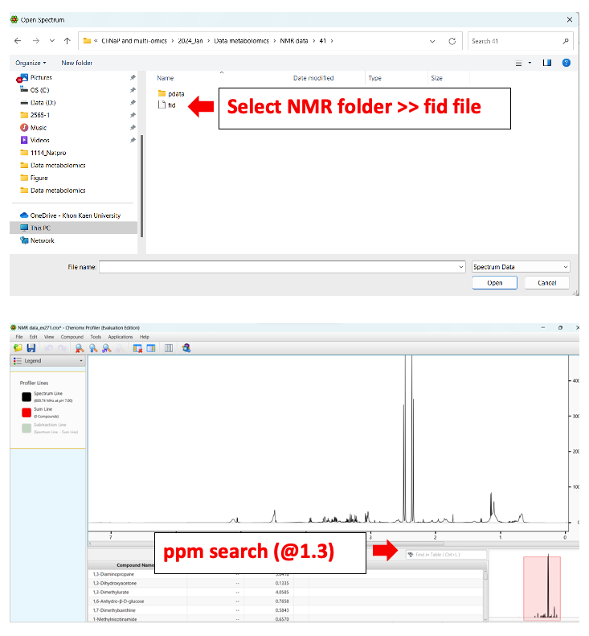
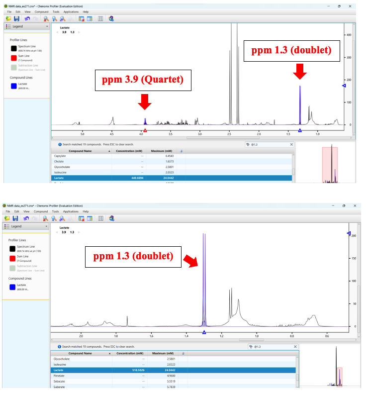
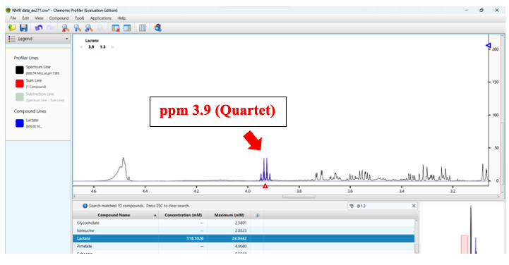
