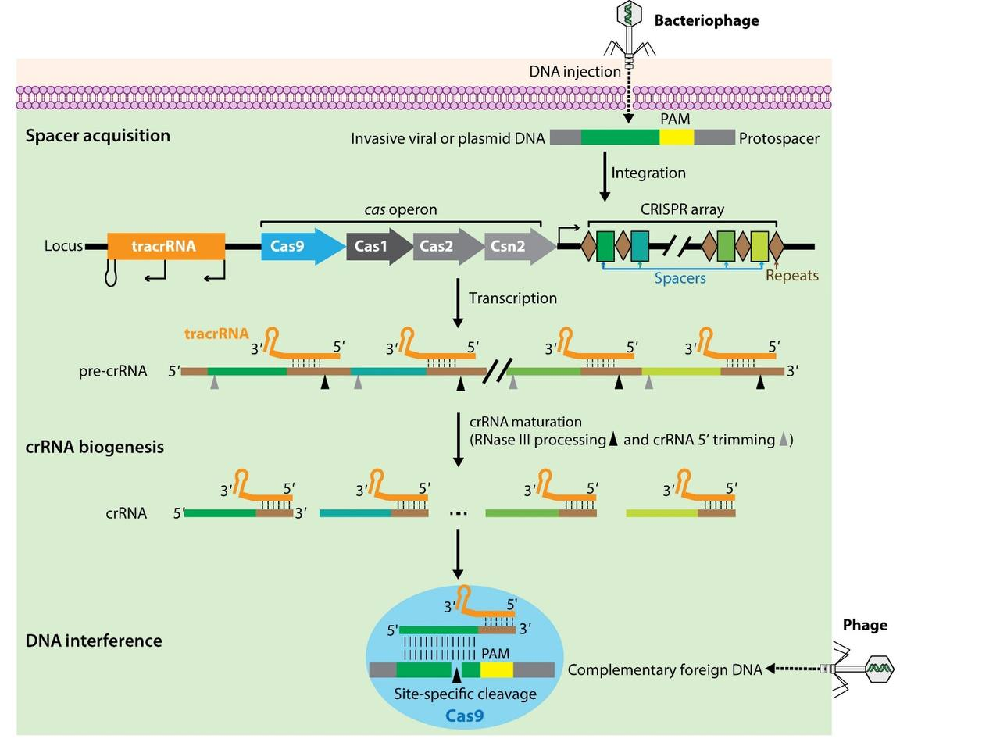
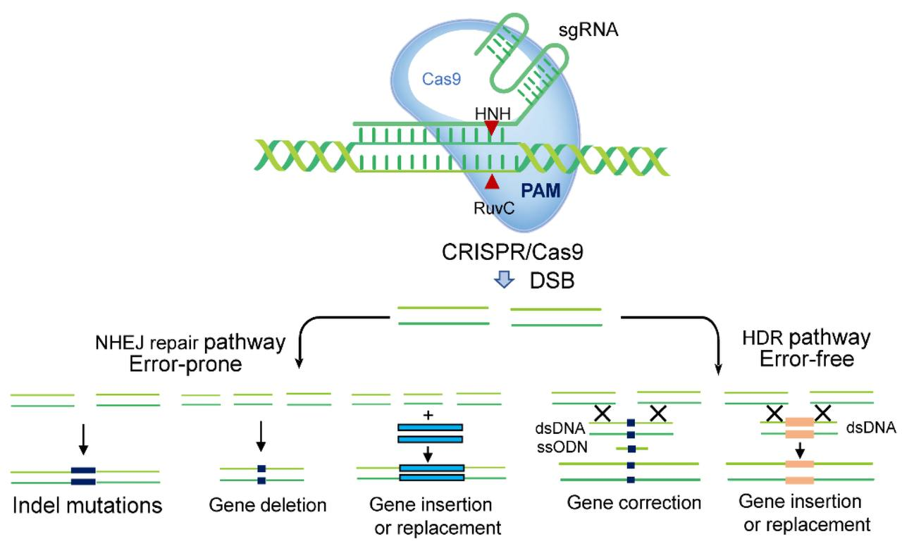

---
output:
  word_document: default
  html_document: default
---
# Principle of CRISPR

## 1.	Introduction
Accurate genome modification is significant in genetic engineering. Technological advancements now enable the application of techniques facilitating genome changes. Key tools for genome editing include zinc finger nucleases (ZFNs) and transcription activator-like effector nucleases (TALENs). The common feature of genome editing involves introducing DNA double-strand breaks (DSBs) at desired locations in the target genome. A DSB activates the natural DNA repair system, enhancing the efficiency of introducing genome alterations. However, ZFNs and TALENs show the main disadvantages, including the probability of unwanted gene editing at off-target sites and the possibility of inducing mutation at off-target sites, respectively. The discovery of clustered regularly interspaced short palindromic repeats (CRISPR)-CRISPR associated (Cas) system, a prokaryotic adaptive immune system, provides specific and acquired immunity against exogenic or mobile genetic elements from invading pathogens, following development into a precise genome editing tool. CRISPR-Cas systems utilize the dual RNA-guided DNA endonuclease Cas9 to protect against invading phages by creating site-specific DSBs in phages’ DNA. 

## 2.	CRISPR-Cas Biology
CRISPRs were identified in the bacteria (Escherichia coli) and archaea genome in 1987 and 1993, respectively. The CRISPR locus comprises a repetitive sequence (repeats) interspersed with non-repetitive sequences (spacers), along with CRISPR-associated genes (cas operon) positioned next to the CRISPR array. This is followed by the trans-activating CRISPR RNA (tracrRNA) gene within the cas operon series. CRISPR-Cas systems are categorized into six types based on different effector modules, each containing a signature Cas protein and cas genes. The Cas9 protein in a type II as a single effector module, stands out for its precision in targeting specific DNA sequences and becomes the most used for genomic editing in much scientific research. The Cas9 protein comprises two nuclease domains (NUC), namely HNH and RuvC, and a recognition domain (REC). Additionally, the PAM sequences, a preserved sequence motif found near the crRNA-targeted sequence on the invading DNA, play a crucial role in activating the Cas9 protein. The interaction of crRNA-tracrRNA with targeted DNA results in the formation of an RNA-DNA hybrid known as the R-loop, eventually leading to DNA cleavage.

**Fig 1. The locus, biogenesis, and mechanism of action of CRISPR-Cas9 system (F. Jiang & Doudna, 2017)**

## 3.	Mechanism of Action
CRISPR/Cas9 functions against invading pathogens through three stages: adaptive, expression, and interference. In the adaptive stage, Cas endonuclease breaks the DNA of invading phages at short protospacer-adjacent motif (PAM) sequences. These protospacers are integrated into the CRISPR array, becoming spacers. The expression stage involves the transcription of cas genes, CRISPR array into precursor CRISPR RNA (pre-crRNA), and tracrRNA gene into a unique non-coding RNA. In the interference stage, the mature crRNA-tracrRNA, which can be a single guide RNA (sgRNA), duplex with Cas9 protein for forming an active ribonucleoprotein (RNP) complex that cleaves the complementary DNA of re-infected phages at the PAM sequence. This induces DSBs in the phages' DNA, initiating the DNA repair system through pathways such as homologous-directed repair (HDR) or non-homologous end joining (NHEJ), which may introduce insertions or deletions (Indel) and disrupt the targeted gene.

**Fig 2. Cellular DNA repairing mechanisms generated by CRISPR-Cas9 cleavage (Wan et al., 2021)**

## 4.	Delivery Methods
The delivery methods are crucial for the potential of CRISPR-Cas9 system. To achieve this, the sgRNA with Cas9 protein must be efficiently transported into target cells using suitable vectors. Currently, two primary types of delivery platforms exist: viral and non-viral vectors. Non-viral vectors, part of nanotechnology-based drug delivery systems, involve substances like lipid nanoparticles, polymer nanoparticles, or gold nanoparticles for CRISPR-Cas9 therapy. On the other hand, viral vectors utilize their ability to transfer foreign genetic materials (transduction) into target cells. Notable examples of viral vectors include adeno-associated virus (AAV), lentivirus, and adenovirus, each offering specific advantages suitable for diverse research applications.

## [**Hands-on**](../Hands%20on/Example.html)

