---
output:
  word_document: default
  html_document: default
---
# **Data tegration**

1. **M2IA account registration**
Users are recommended to register an account by clicking sign up. Within the account system, users can manage own projects.

A demo account has also been created for users who prefer being familiar with the basic features and main steps of M2IA before registering a personal account. Meanwhile, a pre- analyzed project with a complete data analysis report has been loaded for an overview. Users can access the project through the quick tour button on the top right corner of the main page.

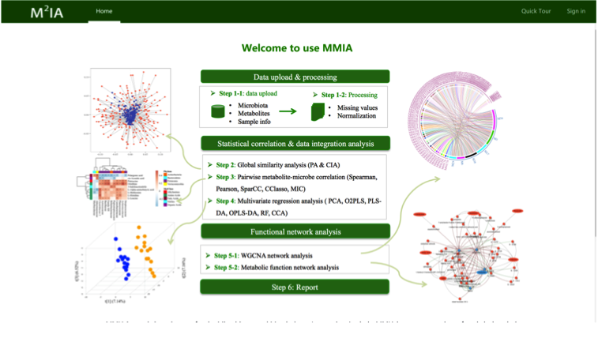

2. **Eight steps to complete a project**
To complete a project successfully, users need to go through eight major steps within the M2IA GUI. (1) Create a project. (2) Load data files. (3) Overview sample information table. (4) Set parameters. (5) Submit a job. (6) Check progress. (7) Check report. (8) Download results.

**(1) Create a project**
Click the Project on the top, and then click the “+” button on the left bar, a new project will be created automatically after users fill in the necessary items and click the confirm button.

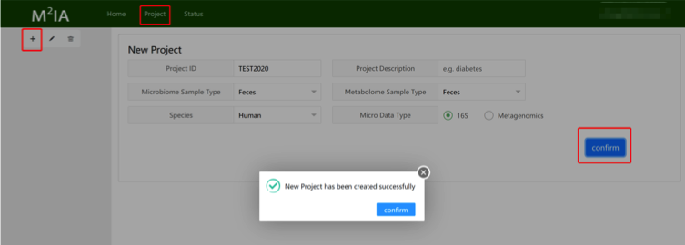

**(2) Load data files.**
The next step is to load data files on the page ‘File Upload’.

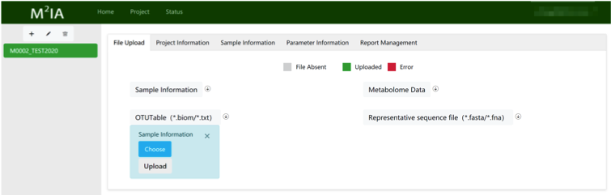

**! Sample Information table:**
This is a csv format table with 6 columns of information (required). (1) MetaID:
sample IDs from metabolome analysis; (2) MicrobioID: sample IDs from microbiome analysis; (3) ClassNote: sample class name; (4) Class: grouping IDs; (5) MetaIn: whether samples from metabolome analysis are included for the following analysis (0-No, 1-Yes); (6) MicrobioIn: whether samples from microbiome analysis are included for the following analysis (0-No, 1-Yes).

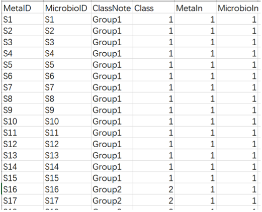

**! Metabolome Data:**
This is a csv format table with HMDB IDs and compound names (required). The
metabolite class information can be provided by users or automatically matched by M2IA if not provided. The sample IDs should be consistent with the MetaIDs provided in the sample information table.

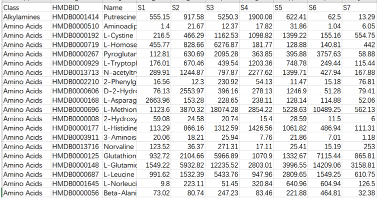

**! OTU Table:**
This is a text format file with OTU_ID and taxonomy (required). Similarly, the
sample IDs should be consistent with MicrobioIDs provided in the sample information table.

**! Representative sequence file:**
This is a fasta format file. The reference sequence ID should be consistent with the
OTU_ID in the OTU table.

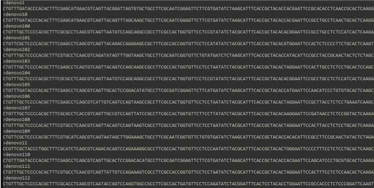

**(3) Overview sample information table**
On the page ‘Sample Information’, users can overview the sample information table. By clicking the ClassNote Batch Conversion, users can modify the class note batch by batch.

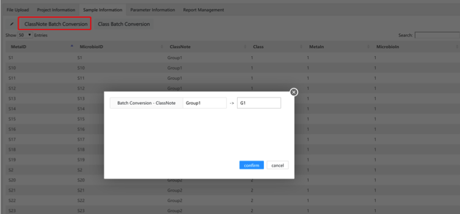

By clicking the modify button, users can modify any item in the sample information table.

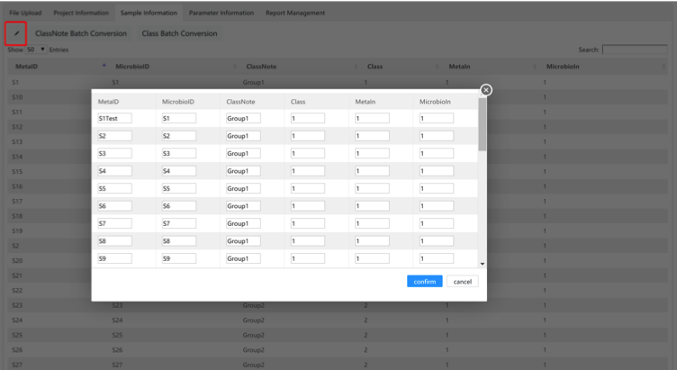

**(4) Set parameters**
These parameters need to be adjusted and confirmed before starting the data analysis, including missing value filtering and imputation, data normalization, univariate test, similarity overview, multivariate analysis, correlation analysis, and function analysis.

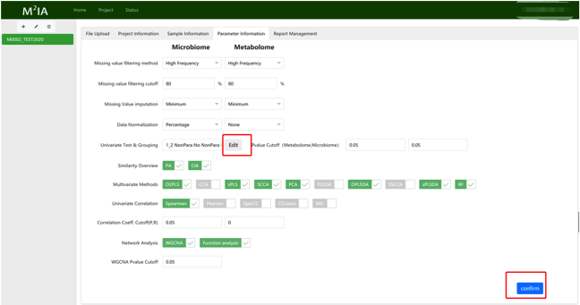

Among which, the univariate test requires users to click the edit button. Within the pop-up window, users can define which two groups are needed for comparison and select the appropriate method for analysis, such as parametric student t test or non- parametric Mann-Whitney U test. The ‘Auto’ option will determine an appropriate method automatically by evaluating whether more than 60% of variables follow the normal distribution or not. If the “paired” option is selected, M2IA will choose the pairwise univariate analysis method. Meanwhile, it requires the sample IDs should have the same suffix number in two different groups (e.g., A_1 and B_1, A_2 and B_2). For more information, please click the red “help” button on the left.

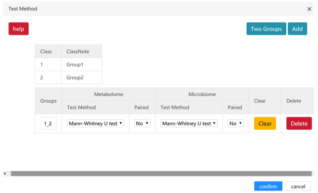

Finally, users should click the confirm button to confirm all the parameter settings.

**(5) Submit a job**
Go to the page of Report Management, click the “Generate Report” button to submit a job and start the data analysis. Meanwhile, the ‘Preview Report’ button is grey until the report is generated.

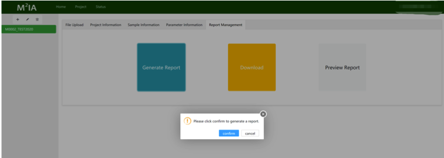

**(6) Check progress**
Go to the page of status, users can check the status of submitted jobs.

**(7) Check report**
When the status of a job is “finished”, users can go to the page of Report Management and click the “Preview Report” button to check the report.

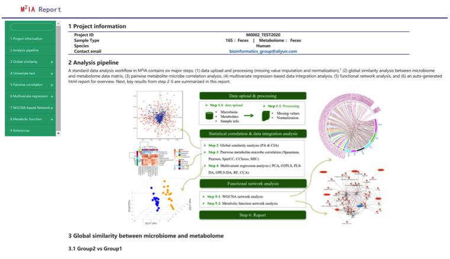

**(8) Download Results**
Go to the ‘Download’ page to download a zip-compressed package that contains all the supporting tables and figures.
To be noted, user account will be deactivated after 3 months inactivity and all the data
files and results associated with the account will be permanently removed from the Cloud Server. However, you may delete your projects immediately after your results are
downloaded.

