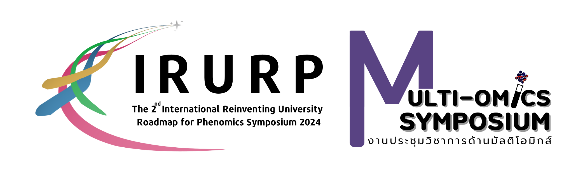
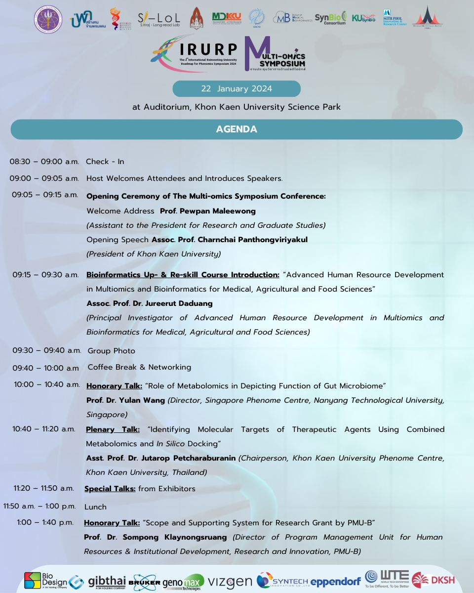

# MultiOmics2024
<!-- pagebreak -->

<!-- pagebreak -->
# Cover

<!-- pagebreak -->

# Agenda

<!-- pagebreak -->
# Exhibitors
<!-- pagebreak -->
# Table of Contents
- [Content](#content)
- [UNIX](./02%20UNIX%20session/Content/Unix_Doc.html)
- [UNUX2](./02%20UNIX%20session/Content/Unix_Commands.html)
<!-- pagebreak -->
# Content

Agenda Short Course in Multi-Omics on 23 January - 2 February 2024 
at 9th Floor Khon Kaen Innovation Center (KIC) Building 

|Day/Time|Activity|
|:---:|:---:|
|23th Jan 2024|
|8:30-9:00|Check-in|
|9:00-10:30|Computational thinking and study design|
|10:30-11:00|Coffee break & Networking|
|11:00-12:00|Principle of Unix|
|12:00-13:00|Lunch|
|13:00-15:00|Hands on: Experimental design and analytical planning|
|15:00-15:30|Coffee break & Networking|
|15:30-17:30|Hands on: Unix|
|24th Jan 2024|
|8:30-9:00|Check-in|
|9:00-10:00|Principle of R programing|
|10:00-10:15|Coffee break & Networking|
|10:15-12:15|Hands on: R programming|
|12:15-13:15|Lunch|
|13:15-14:15|Principle and hands on: Python|
|14:15-14:30|Coffee break & Networking|
|14:30-16:30|Principle of statistics for omics|
|16:30-17:30|Sample preparation|
|25th Jan 2024|
|8:30-9:00|Check-in|
|9:00-10:00|Graphical, visualization and interpretation|
|10:00-10:15|Coffee break & Networking| 
|10:15-11:45|Principle of genomics I|
|11:45-13:00|Lunch| 
|13:00-14:30|Principle of genomics II|
|14:30-14:45|Coffee break & Networking| 
|15:00-17:00|Hands on: Genomics practice I |
|16:30 -17:30|Hands on: Genomics practice II|
|26th Jan 2024|
|8:30-9:00|Check-in|
|9:00-10:30|Principle of transcriptomics I|
|10:30-10:45|Coffee break & Networking| 
|10:45-12:15|Principle of transcriptomics II|
|12:15-13:15|Lunch| 
|13:15-15:15|Hands on: Transcriptomics practice I|
|15:15-15:30|Coffee break & Networking| 
|15:30-17:30|Hands on: Transcriptomics practice II|
|27th Jan 2024|
|8:30-9:00|Check-in|
|9:00-10:30|Principle of Metabolomics|
|10:30-10:45|Coffee break & Networking| 
|10:45-12:15|Principle of Metabolomics|
|12:15-13:15|Lunch| 
|13:15-15:15|Hands on: Metabolomics practice I|
|15:15-15:30|Coffee break & Networking| 
|15:30-17:30|Hands on: Metabolomics practice II|
|28th Jan 2024
|8:30-9:00|Check-in|
|9:00-10:30|Mini project| 
|10:30-10:45|Coffee break & Networking| 
|10:45-12:15|Mini project| 
|12:15-13:15|Lunch| 
|13:15-15:15|Mini project| 
|15:15-15:30|Coffee break & Networking| 
|15:30-17:30|Mini project| 
|29th Jan 2024
|8:30-9:00|Check-in|
|9:00-10:30|Principle of Proteomics|
|10:30-10:45|Coffee break & Networking| 
|10:45-12:15|Principle of Proteomics|
|12:15-13:15|Lunch| 
|13:15-15:15|Hands on: Proteomics practice I|
|15:15-15:30|Coffee break & Networking| 
|15:30-17:30|Hands on: Proteomics practice II|
|30th Jan 2024
|8:30-9:00|Check-in|
|9:00-10:30|Principle of CRISPR|Natthawut
|10:30-10:45|Coffee break & Networking| 
|10:45-12:15|Principle of CRISPR|Natthawut
|12:15-13:15|Lunch| 
|13:15-14:45|Hands on: CRISPR|
|14:45-15:00|Coffee break & Networking| 
|15:00-16:30|Hands on: CRISPR|
|31st January 2024
|8:30-9:00|Check-in|
|9:00-10:30|Microbiome|
|10:30-10:45|Coffee break & Networking| 
|10:45-12:15|Microbiome| 
|12:15-13:15|Lunch| 
|13:15-15:15|Hands on: Microbiome|
|15:15-15:30|Coffee break & Networking| 
|15:30-17:30|Hands on: Microbiome|
|1st February 2024
|8:30-9:00|Check-in|
|9:00-10:30|Data integration |
|10:30-10:45|Coffee break & Networking| 
|10:45-12:15|Data integration |
|12:15-13:15|Lunch| 
|13:15-15:15|Hands on: Data intregation I|
|15:15-15:30|Coffee break & Networking| 
|15:30-17:30|Hands on: Data integration II|
|2nd February 2024
|8:30-9:00|Check-in|
|9:00-10:30|Lecture Examination|
|10:30-10:45|Coffee break & Networking| 
|10:45-12:15|Laboratory Examination|
|12:15-13:15|Lunch| 
|13:15-14:45|Mini project (Group discussion and Presentation)|
|14:45-15:00|Closing ceremony|

* Please note that the schedule is subject to change as appropriate.

