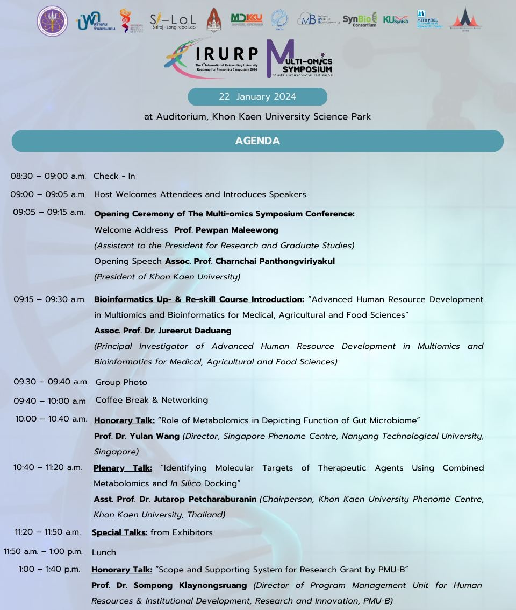
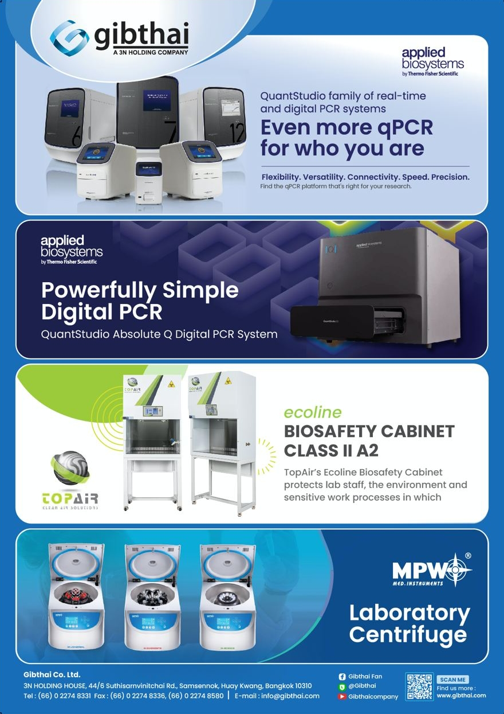
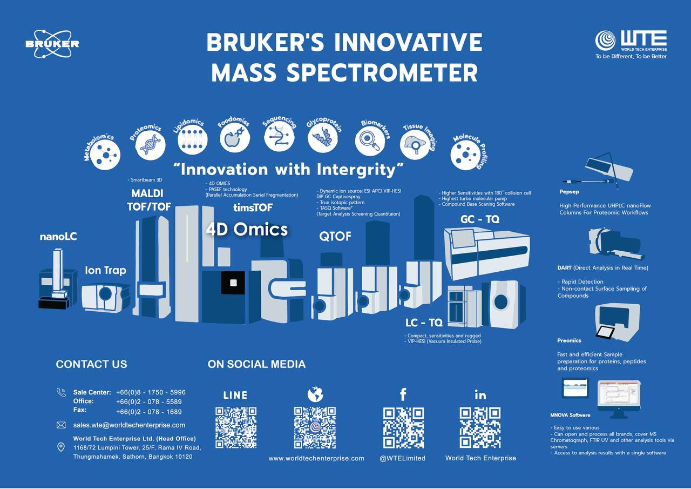
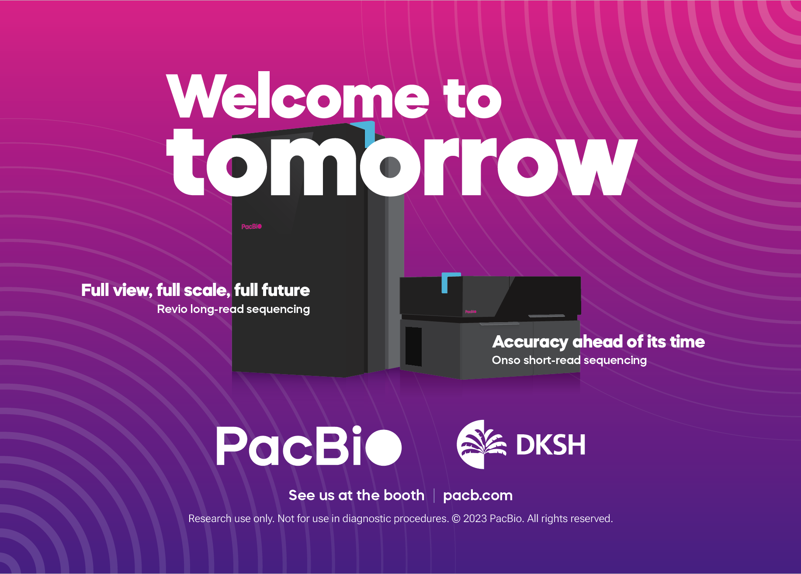

---
editor_options:
  markdown:
    wrap: 72
---

## 

------------------------------------------------------------------------

## 

## [Time table](Page/src/Time%20table/Time_table.html)

------------------------------------------------------------------------

## **Exhibitors**

------------------------------------------------------------------------

## Table of Contents

-   [UNIX](./Page/elements/contents/02%20UNIX%20session/Content/UNIX_Document.html)

-   [Experimental design and analytical planing](./Page/elements/contents/01%20Experimental%20design/Content/HandsOn.html)

-   [R programing](./Page/elements/contents/03%20R%20session/Content/R-document.html)

-   [Sample preparation (Content not available now)](./)

-   [Genomics (Content not available now)](./)

-   [Transcriptomics](./Page/elements/contents/06%20Transcriptomics/Content/RNA.html)

-   [Metabolomics (Content not available now)](./)

-   [Proteomics](./Page/elements/contents/08%20Proteomics/Content/Introduction.html)

-   [CRISPR](./Page/elements/contents/09%20CRISPR/Content/Content.html)

-   [Microbiome (Content not available now)](./)

-   [Data integration](./Page/elements/contents/11%20Data%20integration/Content/Content.html)

------------------------------------------------------------------------

